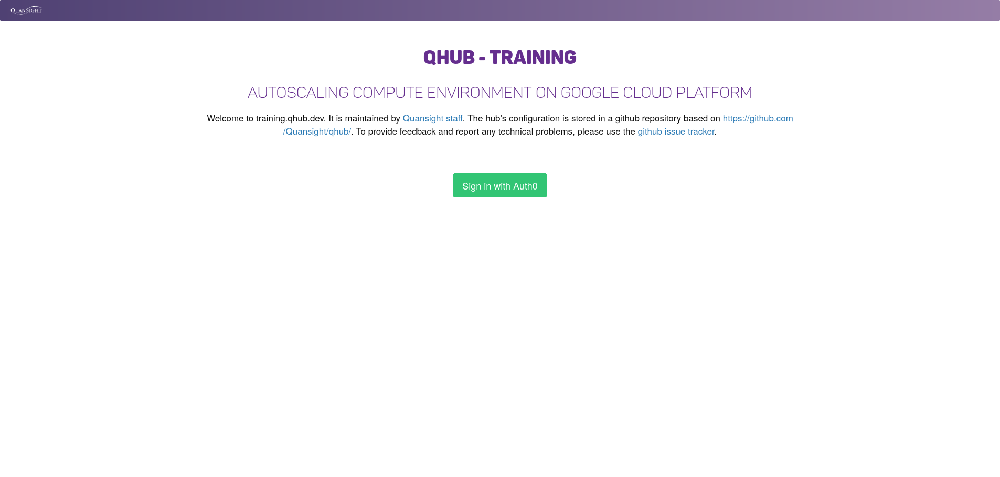
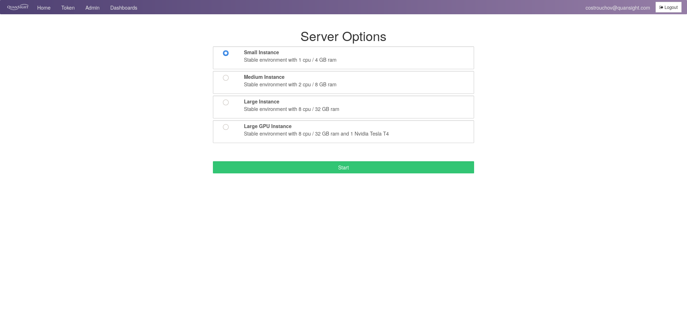
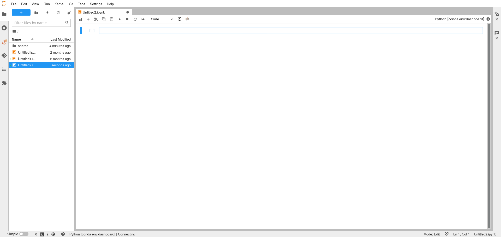

# Log into QHub

This guide aims to give a basic overview of the QHub login process. Your
organization's QHub will likely have a slighly different authentication
process due to the many authentication providers that QHub can integrate with.

Get the URL of your QHub cluster. For this example we will use
`https://training.qhub.dev`.

Once on the site, you will be prompted by a login, similar to the login page shown above. The login process will differ greatly between authentication providers. QHub supports LDAP, OAuth2, passwordless authentication, password-based authentication and many others. Any authentication process
that JupyterHub supports, QHub also supports. This makes it a little challenging to detail the exact login process.

Once authenticated, the user will be prompted with a set of profiles
that are available for the authenticated user to use. Your given
selections will likely differ from the image shown. The customized
profiles will give you access to fixed cloud resources e.g. 2 CPU, 8 GB RAM,
and 1 dedicated GPU, all of which is configured by your administrator.
Once an appropriate profile has been select, click `start`. At this point, your JupyterHub will be launched, a step which may take up to several minutes due to QHub use of autoscaling under the hood. Ultimately this autoscaling feature helps reduce costs when the cluster is idle.

Finally once the your JupyterHub instance has been launched you will notice a selection of available python environments. These environments are
configured by your administrator.

From the Launcher, with a double-click, you can launch a JupyterLab notebook with that given conda environment. Note that kernels can take several seconds to become responsive. The circle in the top right hand corner is a good indicator of the status of the kernel. A lightning bold means that the
kernel has started but it not yet ready to run code.
